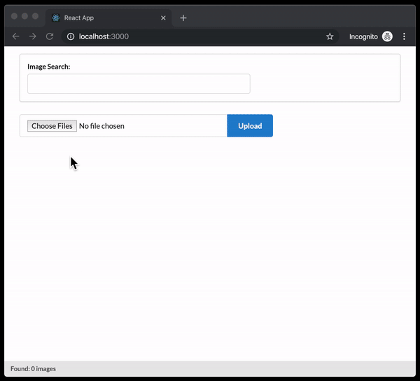
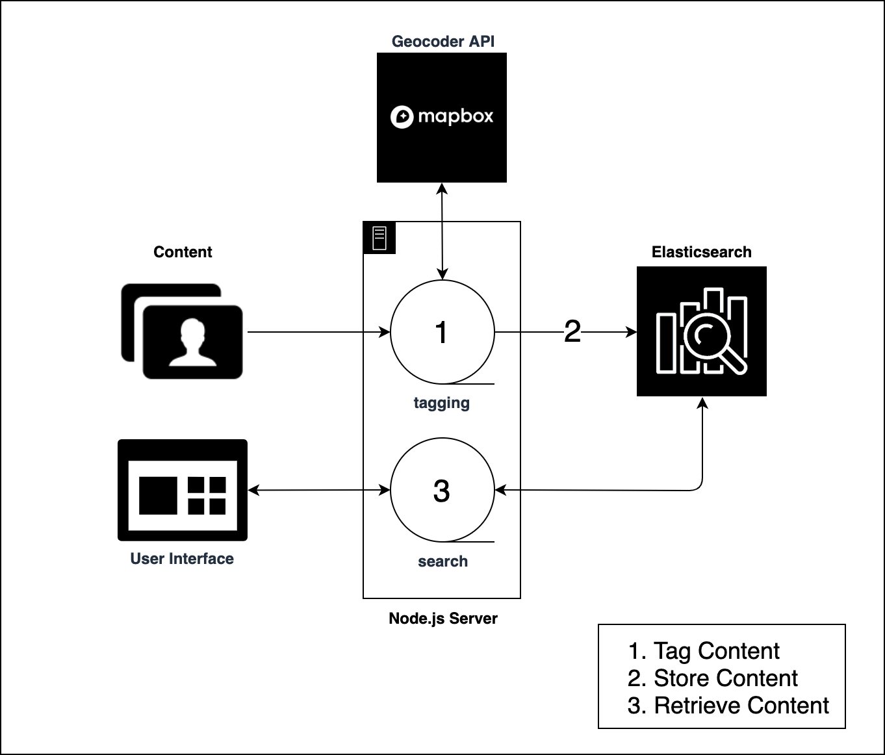
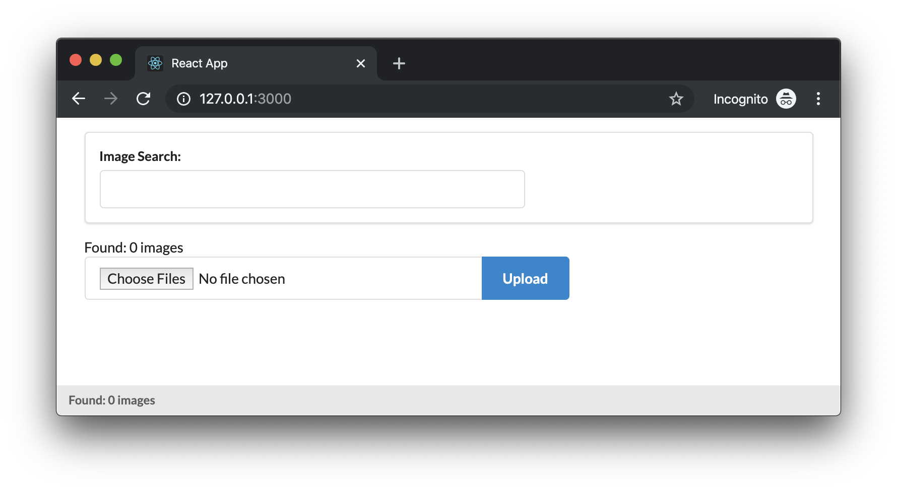
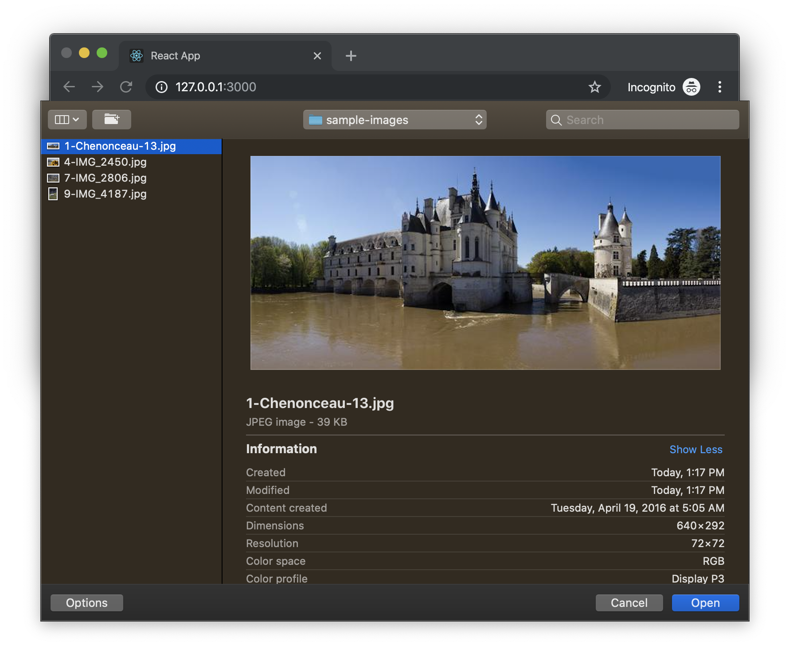
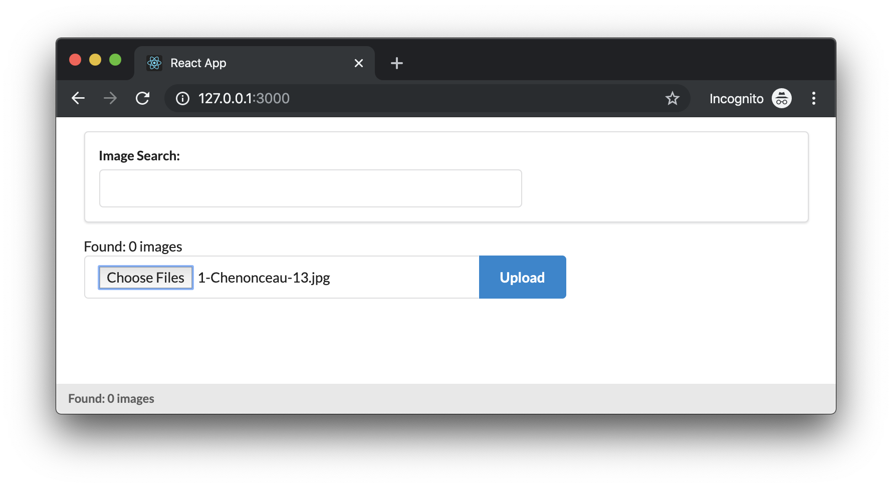
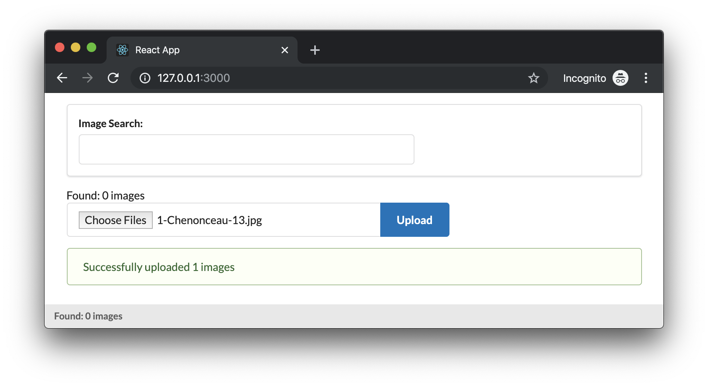
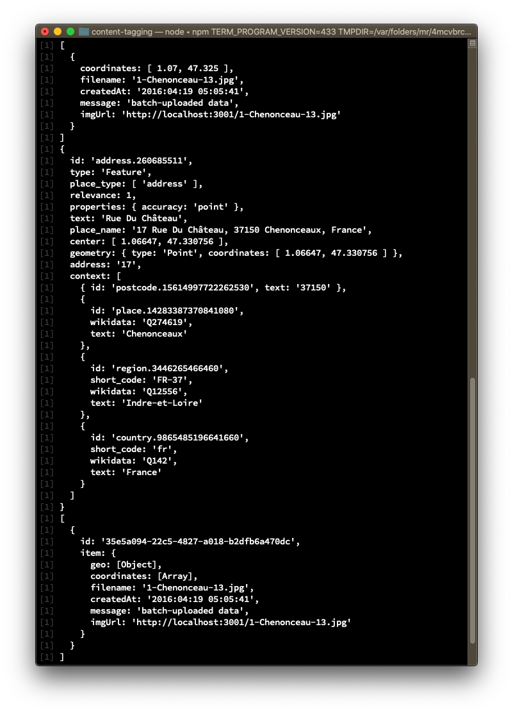
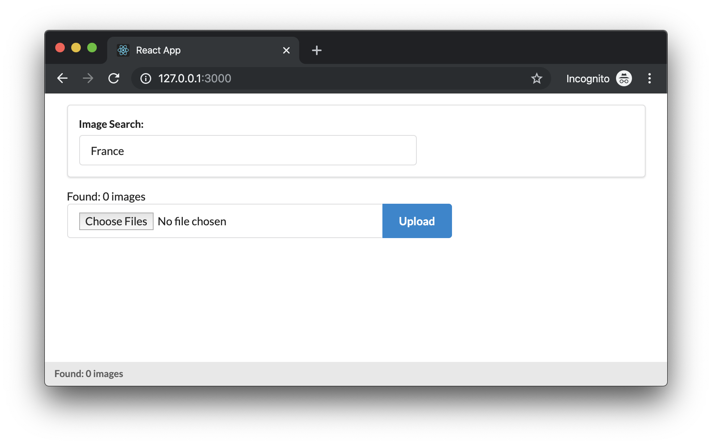
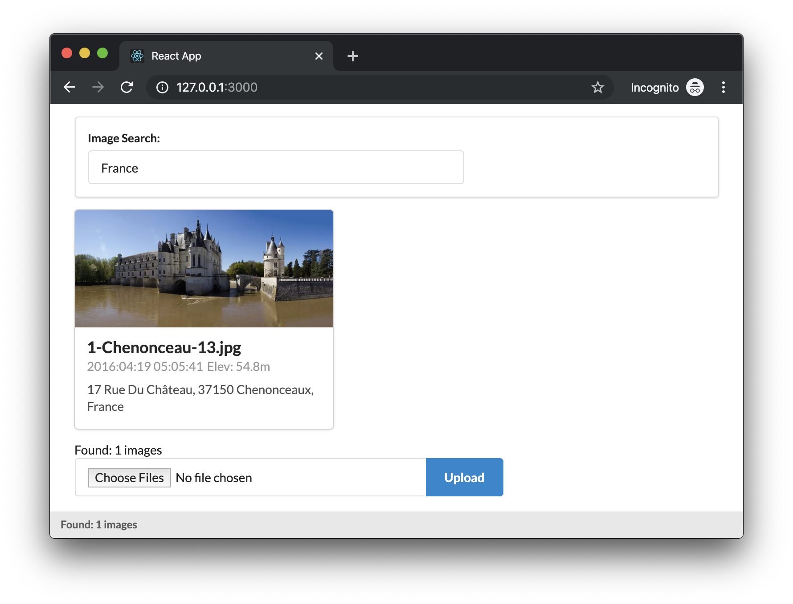

# Content Tagging

This Solution Architecture provides an easy-to-use template to tag your content with location context, store it, and then retrieve it based on end-user searches. This solution is comprised of two applications, a Node.js API server that handles content ingestion and search, and a UI frontend to upload and visually display content that has been indexed.



<!-- TOC -->

- [Content Tagging](#content-tagging)
  - [Requirements](#requirements)
    - [Node](#node)
    - [Docker](#docker)
    - [Elasticsearch](#elasticsearch)
    - [Mapbox](#mapbox)
    - [Configuration](#configuration)
  - [Development](#development)
    - [Installation](#installation)
    - [Starting the Application](#starting-the-application)
    - [Uploading Images](#uploading-images)
    - [Searching](#searching)
  - [Deployment & Customization](#deployment--customization)
    - [Elasticsearch and Docker](#elasticsearch-and-docker)
    - [Ingesting Other Types of Content](#ingesting-other-types-of-content)
    - [Enhanced Tagging](#enhanced-tagging)
    - [Tuning Elasticsearch](#tuning-elasticsearch)
  - [Authors](#authors)
  - [License](#license)

<!-- /TOC -->



## Requirements

To begin development you will need the following:

### Node

You will need to have Node v8.10+ [installed](https://nodejs.org/en/download/) to run this solution.

### Docker

For development purposes only you will need to have [Docker installed](https://docs.docker.com/v17.09/engine/installation/). This is used to run the default Elasticsearch instance that will power indexing and search.

### Elasticsearch

For production use, or if you do not wish to use Docker, you must install Elasticsearch v7+. For instructions on installing Elasticsearch in your environment, [consult the Elasticsearch documentation](https://www.elastic.co/downloads/elasticsearch).

For development, this dashboard will run a Dockerized version of Elasticsearch Basic edition. This is free-to-use and features are documented on the [Elastic website](https://www.elastic.co/subscriptions). Mapbox will not provide Elasticsearch support.

### Mapbox

You will need a **Mapbox public token with access to the Mapbox Permanent Geocoding API**. If you do not have a Mapbox account sign up [here](https://mapbox.com/signup). If you don’t have access to the `mapbox.places-permanent` endpoint for permanent geocoding, [contact Mapbox sales](mailto:sales@mapbox.com?cc=solutions@mapbox.com&subject=Content%20Tagging%3A%20Perm%20Geocoding%20Activation&body=Name%3A%20%0ACompany%20I%20work%20for%3A%20%0AMapbox%20Account%20name%20%28if%20I%20have%20one%29%3A%20%0AUse%20case%20for%20content%20tagging%3A%20) to request access.

### Configuration

Once you have secured access to the Permanent Geocoding API, add your Mapbox access token to the environment. You can do this in two ways: either export the access token as an environment variable or create a `.env` file with all your configuration variables. For an example of how to structure your `.env` file, see `sample.dotenv` in the repository.

The configuration variables available:

- `REACT_APP_MAPBOX_ACCESS_TOKEN`: **Required**
- `ELASTIC_URL`: _Optional_, defaults to `localhost:9200`. If you have your own Elasticsearch cluster set the url here

## Development

### Installation

Clone the repository and install dependencies for the server and UI starting in the repository root:

    % npm run install-all

### Starting the Application

In a new terminal window, start both the docker container, user interface, and server from the project root by running:

    % npm start

You will see the react application and development server start with live-reload enabled. 

Be sure to wait for the Docker container to install and load before uploading your images: `"Active license is now [BASIC]; Security is disabled"`

    code/content-tagging(master) ☸ npm start

    > @ start /Users/alexyule/code/content-tagging
    > npm run copy-env && npm run start-samples


    > @ copy-env /Users/alexyule/code/content-tagging
    > if test -f '.env'; then (cp .env ui/); else echo 'no .env file found; assuming you have set REACT_APP_MAPBOX_TOKEN'; fi


    > @ start-samples /Users/alexyule/code/content-tagging
    > concurrently "npm run docker" "nodemon server/app.js " "cd ui && npm start"

    [0]
    [0] > @ docker /Users/alexyule/code/content-tagging
    [0] > docker run -p 9200:9200 -p 9300:9300 -e "discovery.type=single-node" docker.elastic.co/elasticsearch/elasticsearch:7.3.2
    [0]
    [2]
    [2] > pics@0.1.0 start /Users/alexyule/code/content-tagging/ui
    [2] > SKIP_PREFLIGHT_CHECK=true PORT=3000 react-scripts start
    [2]
    [1] [nodemon] 1.19.2
    [1] [nodemon] to restart at any time, enter `rs`
    [1] [nodemon] watching dir(s): *.*
    [1] [nodemon] starting `node server/app.js`
    ...
    [0] {"type": "server", "timestamp": "2020-02-14T01:14:51,256+0000", "level": "INFO", "component": "o.e.l.LicenseService", "cluster.name": "docker-cluster", "node.name": "5b48d54df00f", "cluster.uuid": "HZI_aHIAQhOqZNZiJOOgfQ", "node.id": "_2GEODhzSHaGaGFN8DiVZw",  "message": "license [eb8db313-f4b9-45b9-b5ed-3b2af0a5b8b5] mode [basic] - valid"  }
    [0] {"type": "server", "timestamp": "2020-02-14T01:14:51,258+0000", "level": "INFO", "component": "o.e.x.s.s.SecurityStatusChangeListener", "cluster.name": "docker-cluster", "node.name": "5b48d54df00f", "cluster.uuid": "HZI_aHIAQhOqZNZiJOOgfQ", "node.id": "_2GEODhzSHaGaGFN8DiVZw",  "message": "Active license is now [BASIC]; Security is disabled"  }

This will also a browser window with the UI loaded at `http://localhost:3000` . You should see an `Image Search` form, and a `File Upload` control as seen below.
c



### Uploading Images

Start with uploading an image. From the browser click `Choose Files`, and select a sample image encoded with EXIF GPS information from the `sample-images` folder.





In this example, we are using `chenonceau.jpg` , which was taken in France. The client application POSTs the image to the `/upload` endpoint (see `server/upload.js`) which does several things:

1. Uploads the image to the `/public` folder. To modify where images are stored see [upload.js:7](https://github.com/mapbox/content-tagging/blob/master/server/upload.js#L7)
2. Extracts geographic coordinates from the image's EXIF tags.
3. Calls the ingest function, defined in `server/ingest.js`.
4. The ingest function calls the Mapbox Geocoding and Raster Tiles APIs to add location and elevation metadata
5. Inserts a reference to the image along with all metadata into Elasticsearch for indexing. Since this is our first piece of content, Elasticsearch automatically creates a new index with default mappings. Read more about how to [customize Elasticsearch mappings here](https://www.elastic.co/guide/en/elasticsearch/reference/current/mapping.html).

Upon completion, a status box will appear indicating that the image was successfully uploaded.



In the terminal, you will see the results of the ingest function requesting geographic and elevation data from Mapbox.



### Searching

Once you have the image uploaded, from the Image Search form, type in “France” or “Chenonceau”. To view all uploaded images search for “\*”. The interface passes the search query to the `/search` endpoint (see `server/search.js` for more) which performs a basic full-text search of our Elasticsearch index.



Press return and the image you uploaded appears.



## Deployment & Customization


### Elasticsearch and Docker
For more control over your data, run the ElasticSearch container in its own terminal window. This will allow your indexed data to persist between launches (uploaded images will still remain in `/public`).

    % npm run-script docker -->

In a production environment, [use snapshots to prevent data loss](https://www.elastic.co/guide/en/elasticsearch/reference/current/modules-snapshots.html) in the event of a stopped Elasticsearch process.


### Ingesting Other Types of Content

The `/upload` api uploads and ingests images by extracting EXIF information and passig it to the `ingest` functions. However the application can also be used to tag and index other types of content by using the `/ingest` api directly.

Any piece of content with a latitude and longitude can be tagged and indexed in this way provided it has latitude, longitude, and a url (referenced here as `imgUrl`). For example, to ingest an image stored elsewhere:

```
curl --request POST \
  --url http://localhost:3001/ingest \
  --header 'content-type: application/json' \
  --data '[{"imgUrl": "https://upload.wikimedia.org/wikipedia/commons/thumb/b/bc/Beijing_montage_2019.png/1024px-Beijing_montage_2019.png","coordinates": ["116.27963213522958", "39.857073723727865"],"createdAt": "tuesday","message": "this is taken outside the forbidden palace"}]'
```

### Enhanced Tagging

There are several ways to augment and extend this solution for production including enhanced tagging:

- Tag content using custom geometry like regions or service areas using the [Mapbox TileQuery API](https://docs.mapbox.com/api/maps/#tilequery).
- Put text documents on the map — tag location extracted from text documents like news articles or ancestral records using forward geocoding.

This logic would be [added to the `processItem` function](https://github.com/mapbox/content-tagging/blob/master/server/ingest.js#L55) found in `server/ingest.js`

### Tuning Elasticsearch

There are many ways to further tune Elasticsearch to return more relevant search results. First, consider mappings, which define how a piece of content and the fields it contains, are stored and indexed. Read more about how to [customize Elasticsearch mappings in the Elasticsearch docs](https://www.elastic.co/guide/en/elasticsearch/reference/current/mapping.html).

A second is to customize the query structure, found in `server/search.js` to do things like only searching certain fields such as Address or Country. Read more about how to construct [Elasticsearch queries in the Elasticsearch docs](https://www.elastic.co/guide/en/elasticsearch/reference/current/query-dsl.html).

Lastly, running Elasticsearch in the cloud makes it easy to deploy, operate, and scale.
There are also several options including [Elastic.co](elastic.co) and [AWS](https://aws.amazon.com/elasticsearch-service/)

## Authors

Mapbox Solutions Architecture

## License

This project is licensed under the BSD-3-Clause License - see the [LICENSE.md](LICENSE) file for details
